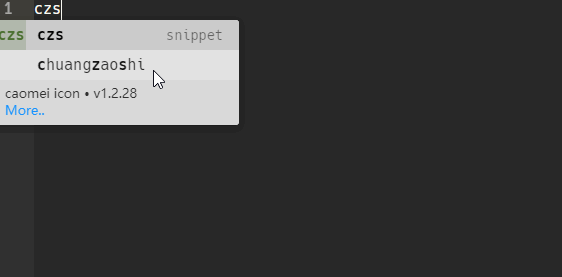

# atom-autocomplete-caomei

Font caomei autocomplete and icon previews for Atom.



## Features

- Shows icon previews alongside suggestions
- Supports Font caomei versions 1.2.28 and 2.0.0
- Includes HTML snippets for using icons
- Also searches aliases so icons are easier to find
- Displays the unicode value for each icon
- ~~Provides links to documentation for each Font caomei icon~~

## Versions

The default is Font caomei version 1.2.28. To switch between Font caomei versions, go into Atom's Settings/Preferences &gt; Packages &gt; atom-autocomplete-caomei &gt; Settings &gt; Font caomei Version.

## Installation

Go into Atom's Settings/Preferences &gt; Install &gt; search for `atom-autocomplete-caomei`

Or install via the command line:

```
apm install atom-autocomplete-caomei
```
